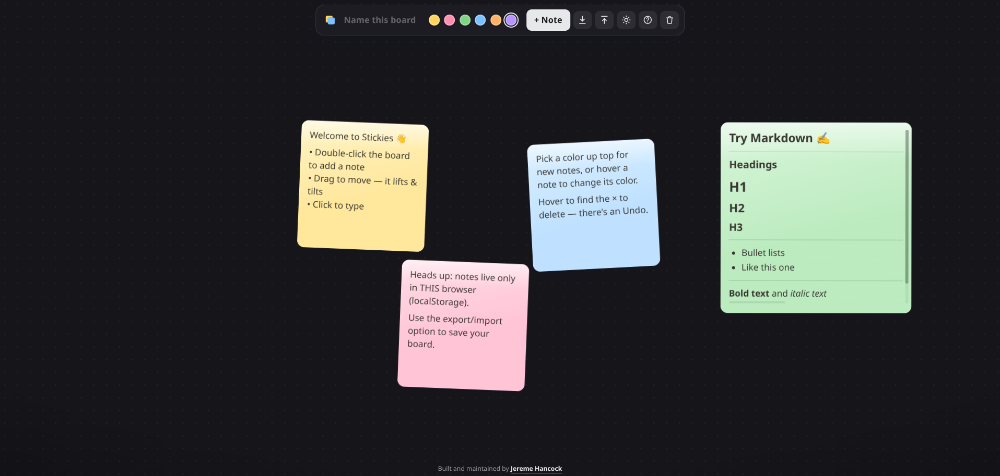

# Stickies

A sleek, single-file sticky-note whiteboard for quickly capturing ideas. No build
step and no dependencies for the core app — just open `index.html` in a browser.
Notes also support **Markdown** formatting when the page is online (see
[Markdown](#markdown) below).

## Screenshot

## Use it

Open `index.html` (double-click the file, or serve the folder). That's it.

- **Add** — double-click anywhere on the board, or hit **+ Note**.
- **Type** — click a note and start writing.
- **Format with Markdown** — write Markdown and it renders when you click away
  (click back in to edit the raw text). **Only when the page is online / hosted** —
  offline, notes stay as plain text. See [Markdown](#markdown) below.
- **Move** — drag it. The note lifts, tilts toward the direction you fling it, and
  springs back to rest when you let go.
- **Resize** — drag the corner grip. Notes stay in tidy sticky-note proportions
  (within a min and max size), and any text past the note's height scrolls inside it.
- **Change Color** — every new note is created in a random color; hover a note and
  click the color button to pick a different one.
- **Font** — hover a note and choose from 5 fonts: Sans Serif, Serif, Monospace,
  Handwritten, or Rounded. Each note can use a different font. All fonts use
  system font stacks, so they work offline on every device.
- **Text Size** — hover a note and pick Small, Medium, Large, or X-Large. The
  size applies to all text in the note, including rendered Markdown content.
- **Tilt** — hover a note and use the tilt button to choose how much it leans,
  with a slider. Slide to the centre (or hit the straighten button) for **no
  tilt**. Each note remembers its own angle.
- **Delete** — hover and hit **×**. There's an **Undo** (also <kbd>Ctrl</kbd>/<kbd>⌘</kbd>+<kbd>Z</kbd>).
- **Rename the board** — click the board name in the top bar and type. The browser
  tab updates to match.
- **Switch theme** — Stickies opens in **dark mode**; toggle light/dark with the
  sun/moon button in the top bar. Your choice is remembered on this device.
- **Export / Import** — use the ↓ button to **export** the board to a
  `stickies-<board-name>.json` file, and the ↑ button to **import** one back.
  Each opens a short explainer first. ⚠️ **Importing completely overwrites** the
  board stored in this browser — there's no undo — so export first if you want a
  backup. The file is created locally; nothing is uploaded.

### On mobile

Phones and tablets get a dedicated, app-like layout (desktop is unchanged):

- **Add a note** — tap the round **+** button in the bottom-right corner, or
  double-tap the board.
- **Edit** — tap a note to type. A control bar slides in across the top of the
  screen with everything for that note: **color**, **font, size & tilt** (the
  **Aa** button), **move to another page** (**‹ ›**), **delete**, and **Done**.
  Tap **Done** or empty space when you're finished.
- **Move, scroll & resize** — drag a note to move it; on a long note swipe up/down
  to scroll its text without opening the keyboard, and drag sideways to move it;
  drag the corner grip to resize.
- **Menu** — the **⋯** button in the top bar opens **Theme**, **How it works**,
  **Export**, **Import**, and **Clear board**.
- **Undo a delete** — a banner slides up after a delete with an **Undo** button.

### Pages (mobile)

On a phone or tablet, a board can hold several **pages** so you can spread notes
out instead of cramming everything onto one screen:

- **Switch pages** — swipe left or right, or tap the dots at the bottom.
- **Add / remove a page** — tap **+** by the dots to add one (up to 8); an empty
  page can be removed with the **−** that appears next to the dots.
- **Move a note to another page** — tap the note and use the **‹ / ›** buttons in
  its toolbar; moving past the last page makes a new one.

Pages are a mobile feature. On desktop there's no page UI — the board shows **all**
your notes at once — but the page each note belongs to is remembered, so a board
you organize on your phone keeps its pages when you sync it back to mobile.

## Markdown

Notes understand **Markdown**. While you're editing a note you see and edit the
raw text; click (or tap) away and it renders — headings, **bold**, *italic*,
lists, task lists, `code`, blockquotes, links, tables and more. Your notes are
always *stored* as plain Markdown text, so the formatting is just a display layer.

> ⚠️ **Markdown rendering only works when the page is online or hosted.**
>
> Rendering relies on two small libraries — [`marked`](https://marked.js.org/)
> (the parser) and [`DOMPurify`](https://github.com/cure53/DOMPurify) (which
> sanitizes the generated HTML) — loaded from a CDN. If you open `index.html`
> **directly from disk with no internet connection**, those libraries can't load
> and **every note simply shows its plain text instead** — nothing breaks, you
> just don't get the formatting. Because notes are stored as plain text either
> way, toggling connectivity never changes what's saved; reconnect and reload and
> your notes render again.

To always have formatting, serve the folder over HTTP (any static host, or a
quick `python3 -m http.server`) on a machine with network access. The libraries
are version-pinned and verified with Subresource Integrity hashes, so a tampered
or altered file is refused — which just falls back to plain text as well.

## Storage

Your notes — along with the board name and your theme choice — are saved with your
browser's **`localStorage`** — on **this** device, in **this** browser only. They
are **not** synced across devices, shared, or backed up, and clearing your browser
data (or using a private window) wipes them. This is meant as a scratchpad for
ideas, not long-term storage.

Need a backup, or want to carry a board to another browser or device? **Export**
it to a JSON file and **Import** it wherever you like (see above).

## Built with

Vanilla HTML, CSS and JavaScript in one file. No frameworks and no build step.
The only external pieces are the two optional, CDN-loaded libraries used for
Markdown rendering — [marked](https://marked.js.org/) and
[DOMPurify](https://github.com/cure53/DOMPurify). They're pinned to a specific
version with Subresource Integrity hashes and are entirely optional: without them
(offline) the app runs exactly as before, just with plain-text notes.

## License

[MIT License](LICENSE)

## AI Disclosure

This project was created with the help of AI.
