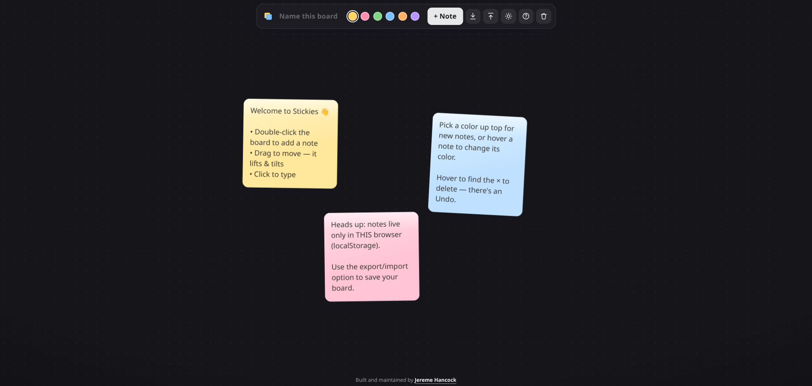

# Stickies

A sleek, single-file sticky-note whiteboard for quickly capturing ideas. No build
step and no dependencies for the core app — just open `index.html` in a browser.
Notes also support **Markdown** formatting when the page is online (see
[Markdown](#markdown) below).

## Screenshot

## Use it

Open `index.html` (double-click the file, or serve the folder). That's it.

- **Add** — double-click anywhere on the board, or hit **+ Note**.
- **Type** — click a note and start writing.
- **Format with Markdown** — write Markdown and it renders when you click away
  (click back in to edit the raw text). **Only when the page is online / hosted** —
  offline, notes stay as plain text. See [Markdown](#markdown) below.
- **Move** — drag it. The note lifts, tilts toward the direction you fling it, and
  springs back to rest when you let go.
- **Resize** — drag the corner grip. Notes stay in tidy sticky-note proportions
  (within a min and max size), and any text past the note's height scrolls inside it.
- **Change Color** — hover a note and tap a color dot (or pick the color for new
  notes from the top bar).
- **Delete** — hover and hit **×**. There's an **Undo** (also <kbd>Ctrl</kbd>/<kbd>⌘</kbd>+<kbd>Z</kbd>).
- **Rename the board** — click the board name in the top bar and type. The browser
  tab updates to match.
- **Switch theme** — Stickies opens in **dark mode**; toggle light/dark with the
  sun/moon button in the top bar. Your choice is remembered on this device.
- **Export / Import** — use the ↓ button to **export** the board to a
  `stickies-<board-name>.json` file, and the ↑ button to **import** one back.
  Each opens a short explainer first. ⚠️ **Importing completely overwrites** the
  board stored in this browser — there's no undo — so export first if you want a
  backup. The file is created locally; nothing is uploaded.

Works with mouse and touch. **On a touch device**, drag a note anywhere to move
it, **tap** a note to edit or scroll its text (tap empty space when you're done),
and drag the corner grip to resize.

## Markdown

Notes understand **Markdown**. While you're editing a note you see and edit the
raw text; click (or tap) away and it renders — headings, **bold**, *italic*,
lists, task lists, `code`, blockquotes, links, tables and more. Your notes are
always *stored* as plain Markdown text, so the formatting is just a display layer.

> ⚠️ **Markdown rendering only works when the page is online or hosted.**
>
> Rendering relies on two small libraries — [`marked`](https://marked.js.org/)
> (the parser) and [`DOMPurify`](https://github.com/cure53/DOMPurify) (which
> sanitizes the generated HTML) — loaded from a CDN. If you open `index.html`
> **directly from disk with no internet connection**, those libraries can't load
> and **every note simply shows its plain text instead** — nothing breaks, you
> just don't get the formatting. Because notes are stored as plain text either
> way, toggling connectivity never changes what's saved; reconnect and reload and
> your notes render again.

To always have formatting, serve the folder over HTTP (any static host, or a
quick `python3 -m http.server`) on a machine with network access. The libraries
are version-pinned and verified with Subresource Integrity hashes, so a tampered
or altered file is refused — which just falls back to plain text as well.

## Storage

Your notes — along with the board name and your theme choice — are saved with your
browser's **`localStorage`** — on **this** device, in **this** browser only. They
are **not** synced across devices, shared, or backed up, and clearing your browser
data (or using a private window) wipes them. This is meant as a scratchpad for
ideas, not long-term storage.

Need a backup, or want to carry a board to another browser or device? **Export**
it to a JSON file and **Import** it wherever you like (see above).

## Built with

Vanilla HTML, CSS and JavaScript in one file. No frameworks and no build step.
The only external pieces are the two optional, CDN-loaded libraries used for
Markdown rendering — [marked](https://marked.js.org/) and
[DOMPurify](https://github.com/cure53/DOMPurify). They're pinned to a specific
version with Subresource Integrity hashes and are entirely optional: without them
(offline) the app runs exactly as before, just with plain-text notes.

## License

[MIT License](LICENSE)

## AI Disclosure

This project was created with the help of AI.
